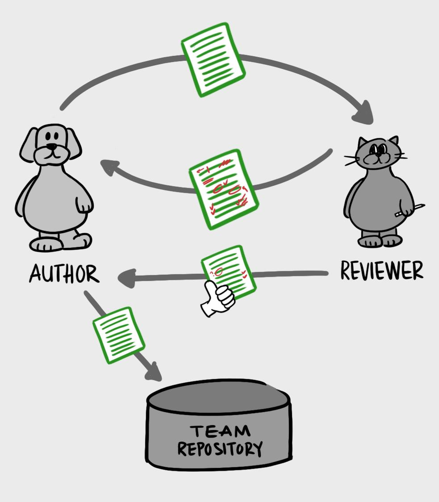

# FeDX 大前端团队代码评审实践文档

## 术语

* **MR**: "Merge Request."的缩写，代表正在进行代码评审的变更
* **LGTM**: "Looks Good to Me."的缩写，评审者批准**MR**时会这么说
* **SGTM**: “Sounds Good To Me."的缩写，评审者批准**MR**时会这么说
* **WIP**: “Work In Progress.”的缩写，如果你有个改动很大的 **MR**，可以在写了一部分的情况下先提交，但是在标题里写上 WIP，以告诉项目维护者这个功能还未完成，方便维护者提前 review 部分提交的代码

## Code Review有什么好处？

* 首先是团队知识共享的角度
* 然后是代码质量的角度
* 还有团队规范的角度

希望大家能认识到Code Review和写单元测试一样，都是属于磨刀不误砍柴工的工作，在上面投入一点点时间，未来会收获代码质量，会节约整体的开发时间。

## 把Code Review作为开发流程的必选项而不是可选项

借此形成未来研发重要指标-**代码评审率**

我们现在就尝试过将代码审查作为代码流程的一部分，但只是一个可选项，没有Code Review也可以把代码合并到develop或者master。这样的结果就是想起来才会去做Code Review，去检查的时候已经有了太多的代码变更，审查起来非常困难，另外就算审查出问题，也很难得以修改。

这样把Code Review作为开发流程的一个必选项后，就很好的保证了代码在合并之前有过Code Review。而且这样合并前要求代码审查的流程，好处也很明显：由于每一次合并前都要做代码审查，这样一般一次审查的代码量也不会太大，对于审查者来说压力也不会太大如果在Code Review时发现问题，被审查者希望代码能尽快合并，也会积极的对审查出来的问题进行修改，不至于对审查结果太过抵触

图片及想法来自:<https://mtlynch.io/human-code-reviews-1/>

## 我思考的常见问题

* **代码评审者提出的都是一些编码风格和代码规范的东西？**
  
   编码规范应该交给工具去做 **(这个我后续一定会做到 add by 金博)** ，代码需遵循 [FeDX 代码风格指南](https://flyfedx.github.io/coding-style/#/)

* **为什么要鼓励为主而不是责罚并举？**
  
  众所周知代码评审并不容易施行，因为它是团队和个人长期才能感受到好处的过程，即使不做似乎也看不到啥影响，业务也照跑，而惩罚是阶段性的反馈，所以现阶段还是以鼓励为主，但是由于对代码提交人和代码评审人要求不同，对提交人的责任要求更大点。对审核覆盖率有要求，也有责任推进评审进度。
对于代码评审主要是鼓励，因为代码评审是利他行为。在某些情况下会有一些惩罚要求：该模块很重要，引发了故障。而此问题是可以通过明显的评审发现的，此时也要承担责任(这是理想情况, 目前不会执行).

* **某个需求（项目）留给开发时间非常紧张时怎么办？**
  
  可以不进行代码评审，优先保证按时需求（项目）上线
