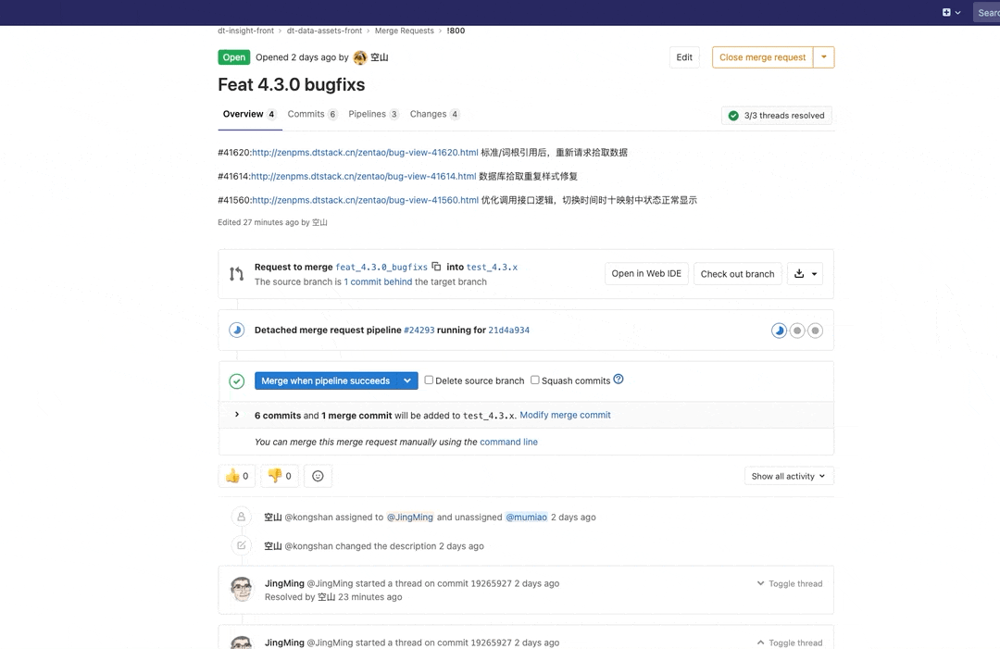

# 代码评审指南

项目的代码是托管在公司内网的 Gitlab 上的，于是开始摸索着基于 GitLab 中项目的**MR**进行他人代码评审，目前代码评审流程机制及使用体验上可能有一些不完善的地方, 我们后续慢慢完善

-   平台暂时没有设置 CI 步骤
-   平台无法设置 CI 不通过的情况下允许 **MR**合并
-   平台评论及反馈不友好，无法直观对比不同提交版本之间的差异及针对评论的修复情况
-   平台发起 1 个**MR**，无法指定多人参与代码评审

## 代码评审目标

-   提高代码质量，及早发现潜在缺陷，降低修改/弥补缺陷的成本
-   促进团队内部知识共享，提高团队整体水平
-   评审过程对于评审人来说，也是一种思路重构的过程，帮助更多的人理解系统
-   是一个传递知识的手段，可以让其它并不熟悉代码的人知道作者的意图和想法，从而可以在以后轻松维护代码
-   鼓励相关学习对方的长处和有点和高效迅速完成代码评审

## 解决代码冲突

如果代码评审中有任何冲突，开发人员和评审人员都应该首先根据[代码开发者指南](./docs/Developer.md)和[代码评审者指南](./docs/Reviewers.md)中其他文档的内容，尝试达成一致意见。  
当很难达成一致时，开发者和评审者不应该在代码评审评论里解决冲突，而是应该召开面对面会议或者找个权威的人来协商。（如果你在评论里协商，确保在评论里记录了讨论结果，以便日后其他人翻阅。）
如果这样都解决不了问题，那解决问题的方式就应该升级了。通常的方式是拉着团队一起讨论、让团队主管来权衡、参考代码维护者的意见，或者让管理层来决定。**不要因为开发者和评审者不能达成一致而把变更一直放在那里。**

## 利用 Gitlab 做代码评审

常见的一些代码评审工具, 后续会应用更多的工具

-   Phabircator（Facebook)
-   Gitlab / Github

### 提交代码评审之前

-   确保经过设计评审，架构和总体技术方案经过论证
-   **MR**描述清楚业务功能，附上原型，主要变更，问题链接
-   充分自测或核心模块经过单元测试
-   代码经过 Gitlab CI 的静态检查(暂不支持)
-   提交范围尽可能小和完整；不要一次性提交大量不相关的功能代码，把评审时间控制在 20min 以内
-   按照 Git Commit 提交规范进行提交
-   不阻塞他人的工作，尽快响应他人的代码评审请求
-   如果某个**MR**紧急，可以告知 Reviewers

### 一次完整的代码评审应该具备如下步骤

-   提交合并请求**MR**
-   触发代码评审提醒和 CI pipeline 执行(暂不支持)
-   代码评审者执行评审过程，代码评审者可以提交评论，其他人也可以参与针对问题进行持续跟进，一个**MR**手动设置多人参与 CR
-   代码评审开发者收到评审意见，创建 issue，修改代码，合并 issue 至**MR**分支，回复评论，关闭 issue
-   代码评审者确认问题是否修复，允许合并

### 代码评审前置步骤

-   git 项目-settings-general-merge request-勾选打开最后一项“ALL discussions must be resolved”-save changes

### MR 评审操作步骤

-   1.开发者提交代码，创建 merge request（feature-1234），指派给评审人
-   2.评审人在 MR 上创建 discussion，描述问题及意见
-   3.开发者收到 discussion，确认问题存在且需要修改，创建 Issues，标题描述修改的问题，例如“修改变量命名歧义”“修改 MR#163-discussion 问题\*3”（同一个 MR 只创建一个 issue，包括所有 discussion 描述的问题）
-   4.开发者在 issues 详情页 create branch，基于原分支（feature-1234）创建 Issues 关联分支，命名方式：issue-原任务编号（issue-1234）
-   5.开发者在新分支上修改 Issues 关联的问题，然后推送合并到原分支（feature-1234）
-   6.评审人确认 discussion 提出的问题已经修改完成，关闭 discussion
-   7.开发者关闭 Issues
-   8.所有 discussion 关闭之后，评审人通过 merge request，代码合并到主分支

### 代码评审流程

### 代码评审者应该关注什么

-   **代码风格**: 代码风格是否遵循 FeDX 编码规范?
-   **设计**：配置、接口类的设计问题（合理性、友好性)？错误、重复的 API 调用或者封装？
-   **功能性**: 代码功能是否和开发者预期一致？逻辑的遗漏缺陷？
-   **复杂性**: 代码能不能更简单？ 其他开发者能否快速理解并在未来很容易地使用这段代码？
-   **命名**: 开发者有没有正确地对变量、类、方法等命名？
-   **文档**: 开发者是否更新了相关文档？
-   **注释**：无用的代码或者注释
-   **测试**: 是否缺少应有的单元测试或者文档(暂不要求)

### 挑选最适合的代码评审者

-   优先选择熟悉该业务域，技术域的开发，事先定好人选
-   指定模块最近参与修改的单个或多个同学作为 Reviewer
-   指定参与相关模块讨论和设计过的人作为 Reviewer
-   指定项目核心开发者作为 Reviewer
-   如有必要，Reviewer 可分配给多个相关人

### 你需要知道的**MR**流程

-   New Merge Request

-   review Merge Request

-   Merge Request

